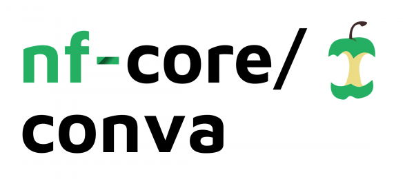

# 

**Copy Number Variation analysis pipeline**

[](https://github.com/nf-core/conva/actions?query=workflow%3A%22nf-core+CI%22)
[](https://github.com/nf-core/conva/actions?query=workflow%3A%22nf-core+linting%22)
[](https://nf-co.re/conva/results)
[](https://doi.org/10.5281/zenodo.XXXXXXX)

[](https://www.nextflow.io/)
[](https://docs.conda.io/en/latest/)
[](https://www.docker.com/)
[](https://sylabs.io/docs/)

[](https://nfcore.slack.com/channels/conva)
[](https://twitter.com/nf_core)
[](https://www.youtube.com/c/nf-core)

## Introduction

**nf-core/conva** is a bioinformatics analysis pipeline to infer copy number variation in normal-tumour paired samples using CNVkit tool. This pipeline is designed for use with whole genome sequencing data from short-read sequencing platforms like Illumina and Ion Torrent. It takes fastq.gz files (tumour and normal) as an input along with a reference genome in FASTA format and a gene annotation database in RefFlat format [e.g. refFlat.txt for hg19](http://hgdownload.soe.ucsc.edu/goldenPath/hg19/database/).

The pipeline is built using [Nextflow](https://www.nextflow.io), a workflow tool to run tasks across multiple compute infrastructures in a very portable manner. It uses Docker / Singularity containers making installation trivial and results highly reproducible. It can also be used with Conda packages.

## Pipeline summary

<!-- TODO nf-core: Fill in short bullet-pointed list of the default steps in the pipeline -->

1. Read QC ([`FastQC`](https://www.bioinformatics.babraham.ac.uk/projects/fastqc/))
2. Quality trimming ([`Cutadapt!`](https://cutadapt.readthedocs.io/en/stable/index.html))
3. Alignment ([`BWA!`](https://github.com/lh3/bwa))
4. Sort and index alignments ([`SAMtools`](https://sourceforge.net/projects/samtools/files/samtools/))
5. Duplicate read marking ([`picard MarkDuplicates`](https://broadinstitute.github.io/picard/))
6. Infer coy number changes ([`CNVkit`](https://cnvkit.readthedocs.io/en/stable/index.html))
7. Present QC for raw reads ([`MultiQC`](http://multiqc.info/))
 
## Quick Start

1. Install [`nextflow`](https://nf-co.re/usage/installation)

2. Install any of [`Docker`](https://docs.docker.com/engine/installation/) or [`Singularity`](https://www.sylabs.io/guides/3.0/user-guide/), [`Podman`](https://podman.io/), [`Shifter`](https://nersc.gitlab.io/development/shifter/how-to-use/) or [`Charliecloud`](https://hpc.github.io/charliecloud/) for full pipeline reproducibility _(please only use [`Conda`](https://conda.io/miniconda.html) as a last resort; see [nf-core-docs](https://nf-co.re/usage/configuration#basic-configuration-profiles))_

3. Download the pipeline and test it on a minimal dataset with a single command:

    ```bash
    nextflow run nf-core-conva -profile test,<docker/singularity/podman/shifter/charliecloud/conda/institute>
    ```

    * Please check [nf-core/configs](https://github.com/nf-core/configs#documentation) to see if a custom config file to run nf-core pipelines already exists for your Institute. If so, you can simply use `-profile <institute>` in your command. This will enable either `docker` or `singularity` and set the appropriate execution settings for your local compute environment.
    * If you are using `singularity` then the pipeline will auto-detect this and attempt to download the Singularity images directly as opposed to performing a conversion from Docker images. If you are persistently observing issues downloading Singularity images directly due to timeout or network issues then please use the `--singularity_pull_docker_container` parameter to pull and convert the Docker image instead. It is also highly recommended to use the [`NXF_SINGULARITY_CACHEDIR` or `singularity.cacheDir`](https://www.nextflow.io/docs/latest/singularity.html?#singularity-docker-hub) settings to store the images in a central location for future pipeline runs.
    * If you are using `conda`, it is highly recommended to use the [`NXF_CONDA_CACHEDIR` or `conda.cacheDir`](https://www.nextflow.io/docs/latest/conda.html) settings to store the environments in a central location for future pipeline runs.

4. Start running your own analysis!


    * Typical command for CNV analysis:

        ```bash
        nextflow run nf-core-conva \
            --input /Full/path/to/samplesheet.csv \
            --fasta GRCh38 \
            --annotate /Full/path/to/annotaionfile \
            -profile <docker/singularity/podman/conda/institute>
        ```

See [usage docs](https://nf-co.re/conva/usage) for all of the available options when running the pipeline.

## Documentation

The nf-core-conva pipeline comes with documentation about the pipeline: [usage](https://nf-co.re/conva/usage) and [output](https://nf-co.re/conva/output).

## Credits

nf-core/conva was originally written by Ravneet Bhuller.

Many thanks to other who have helped out along the way too, including (but not limited to):
[@MGordon09](https://github.com/MGordon09),
[@MartinFritzsche](https://github.com/MartinFritzsche)

<!-- TODO nf-core: If applicable, make list of people who have also contributed -->

## Contributions and Support

If you would like to contribute to this pipeline, please see the [contributing guidelines](.github/CONTRIBUTING.md).

For further information or help, don't hesitate to get in touch on the [Slack `#conva` channel](https://nfcore.slack.com/channels/conva) (you can join with [this invite](https://nf-co.re/join/slack)).

## Citations

<!-- TODO nf-core: Add citation for pipeline after first release. Uncomment lines below and update Zenodo doi and badge at the top of this file. -->
<!-- If you use  nf-core/conva for your analysis, please cite it using the following doi: [10.5281/zenodo.XXXXXX](https://doi.org/10.5281/zenodo.XXXXXX) -->

<!-- TODO nf-core: Add bibliography of tools and data used in your pipeline -->
An extensive list of references for the tools used by the pipeline can be found in the [`CITATIONS.md`](CITATIONS.md) file.

You can cite the `nf-core` publication as follows:

> **The nf-core framework for community-curated bioinformatics pipelines.**
>
> Philip Ewels, Alexander Peltzer, Sven Fillinger, Harshil Patel, Johannes Alneberg, Andreas Wilm, Maxime Ulysse Garcia, Paolo Di Tommaso & Sven Nahnsen.
>
> _Nat Biotechnol._ 2020 Feb 13. doi: [10.1038/s41587-020-0439-x](https://dx.doi.org/10.1038/s41587-020-0439-x).
